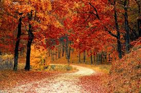
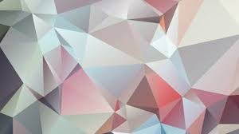
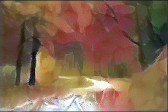

# Neural-Style-Transfer

Neural style transfer is a technique in which we take three images.  1. **A content image**  2. **A style reference image** (such as an artwork by a famous painter),    3. **The input image you want to style**   
 
We blend them together such that the input image is transformed to look like the content image, but “painted” in the style of the style image.  
 
Input image is generally a random image and we use the suitable optimization technique to reduce the loss between **input image and content image** as well as the loss between **input image and style image** to get the desired artistic image.

Content Image 
 

Style Image 
 

Transformed Image 
 

